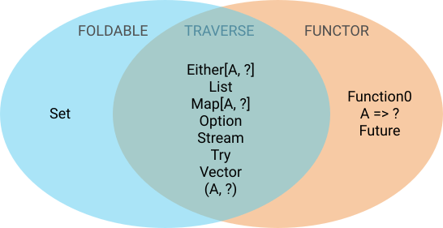

<!DOCTYPE html>
<html>
  <head>
    <title>Functor, Foldable, Traverse</title>
    <meta charset="utf-8">
    <style>
      @import url(https://fonts.googleapis.com/css?family=Yanone+Kaffeesatz);
      @import url(https://fonts.googleapis.com/css?family=Droid+Serif:400,700,400italic);
      @import url(https://fonts.googleapis.com/css?family=Ubuntu+Mono:400,700,400italic);

      body { font-family: 'Droid Serif'; }
      h1, h2, h3 {
        font-family: 'Yanone Kaffeesatz';
        font-weight: normal;
      }
      .remark-code, .remark-inline-code { font-family: 'Ubuntu Mono'; }
    </style>
  </head>
  <body>
    <textarea id="source">

# Functor, Foldable, and Traverse

## IndyScala, May 1, 2017

```tut:invisible
import cats.Eq
implicit class TripleEquals[A](val x: A)(implicit eq: Eq[A]) {
  def =?=(y: A) = {
    if (eq.eqv(x, y)) println(s"\u2714 ${x} == ${y}")
	else println(s"\u274c ${x} == ${y}")
  }
}
implicit def fromUniversalEquals[A]: Eq[A] = Eq.fromUniversalEquals[A]
```

---

## Functor: approximately

"Things that have `.map`"

- Either
- Future
- List
- Map
- Option
- Set
- Stream
- Try
- Vector

---

## Functor: formally

```tut:silent
trait Functor[F[_]] {
  def map[A, B](fa: F[A])(f: A => B): F[B]
}
```

```tut:invisible
object Functor {
  def apply[F[_]: Functor]: Functor[F] = implicitly[Functor[F]]
}

implicit class FunctorSyntax[F[_]: Functor, A](val fa: F[A]) {
  def map[B](f: A => B): F[B] = implicitly[Functor[F]].map(fa)(f)
}
```

```tut:silent
def functorIdentity[F[_], A](fa: F[A])(implicit F: Functor[F], eq: Eq[F[A]]) =
  F.map(fa)(identity) =?= fa

def functorComposition[F[_], A, B, C](fa: F[A], f: A => B, g: B => C)
    (implicit F: Functor[F], eq: Eq[F[C]]) =
  F.map(F.map(fa)(f))(g) =?= F.map(fa)(f andThen g)
```

---

## List

```tut:silent
implicit val listFunctor: Functor[List] = new Functor[List] {
  def map[A, B](fa: List[A])(f: A => B): List[B] = fa.map(f)
}

val fa = List(1, 2, 3)
val f = { x: Int => x + 1 }
val g = { x: Int => x * x }
```

```tut
functorIdentity(fa)
functorComposition(fa, f, g)
```

---

## Either

```tut:silent
implicit def eitherFunctor[C]: Functor[Either[C, ?]] = new Functor[Either[C, ?]] {
  def map[A, B](fa: Either[C, A])(f: A => B): Either[C, B] = fa.map(f)
}

val fa: Either[String, Int] = Right(3)
val f = { x: Int => x + 1 }
val g = { x: Int => x * x }
```

```tut
functorIdentity(fa)
functorComposition(fa, f, g)
```

&#x26a0; This requires `-Ypartial-unification`

---

### Map

```tut:silent
implicit def mapFunctor[K]: Functor[Map[K, ?]] = new Functor[Map[K, ?]] {
  def map[A, B](fa: Map[K, A])(f: A => B): Map[K, B] = fa.mapValues(f)
}
val fa: Map[String, Int] = Map("one" -> 1, "two" -> 2)
val f = { x: Int => x + 1 }
val g = { x: Int => x * x }
```

```tut
functorIdentity(fa)
functorComposition(fa, f, g)
```

&#x1f4a1; Not all functors are based on `.map`

---

## Function0

```tut:silent
implicit val function0Functor: Functor[Function0] = new Functor[Function0] {
  def map[A, B](fa: Function0[A])(f: A => B): Function0[B] = () => f(fa())
}
val fa = () => 3
val f = { x: Int => x + 1 }
val g = { x: Int => x * x }
```

```tut
functorIdentity(fa)
```

&#x1f914;

```tut
implicit def eqFunction0[A]: Eq[Function0[A]] = Eq.by(_())
functorIdentity(fa)
functorComposition(fa, f, g)
```

---

## Future

```tut:silent
import scala.concurrent._, duration._, ExecutionContext.Implicits.global
implicit def futureFunctor(implicit ec: ExecutionContext): Functor[Future] = new Functor[Future] {
  def map[A, B](fa: Future[A])(f: A => B): Future[B] = fa.map(f)(ec)
}
val fa = Future(3)
val f = { x: Int => x + 1 }
val g = { x: Int => x * x }
```

```tut
implicit def eqFuture[A]: Eq[Future[A]] = Eq.by(f => Await.result(f, 1.second))
functorIdentity(fa)
functorComposition(fa, f, g)
```

---

## Set

```tut:silent
import scala.concurrent._, duration._, ExecutionContext.Implicits.global
implicit def setFunctor: Functor[Set] = new Functor[Set] {
  def map[A, B](fa: Set[A])(f: A => B): Set[B] = fa.map(f)
}
val fa = Set(1, 2, 3)
val f = { x: Int => x + 1 }
val g = { x: Int => x * x }
```

```tut
functorIdentity(fa)
functorComposition(fa, f, g)
```

---

## Set

```tut:silent
import scala.concurrent._, duration._, ExecutionContext.Implicits.global
implicit def setFunctor: Functor[Set] = new Functor[Set] {
  def map[A, B](fa: Set[A])(f: A => B): Set[B] = fa.map(f)
}
case class Evil(x: Int) { override def hashCode = 0; override def equals(that: Any) = true }
val fa = Set(1, 2, 3)
val f = { x: Int => Evil(x) }
val g = { x: Evil => x.x }
```

```tut
functorIdentity(fa)
functorComposition(fa, f, g)
```

---

## Revised examples of functors

- Either[A, ?]
- Function0
- Function1[A, ?]
- Future
- List
- Map[A, ?]
- Option
- Stream
- Try
- Vector
- (A, ?)

---

## Functor operations

You can do all these things if you have a functor:

```scala
def widen[A, B >: A](fa: F[A]): F[B] = fa.asInstanceOf[F[B]]
def lift[A, B](f: A => B): F[A] => F[B] = map(_)(f)
def void[A](fa: F[A]): F[Unit] = map(fa)(_ => ())
def fproduct[A, B](fa: F[A])(f: A => B): F[(A, B)] = map(fa)(a => a -> f(a))
def as[A, B](fa: F[A], b: B): F[B] = map(fa)(_ => b)
def tupleLeft[A, B](fa: F[A], b: B): F[(B, A)] = map(fa)(a => (b, a))
def tupleRight[A, B](fa: F[A], b: B): F[(A, B)] = map(fa)(a => (a, b))
```

---

## Foldable: approximately

"Things that have a fold"

- Either
- List
- Map
- Option
- Set
- Stream
- Try
- Vector

---

## Foldable: more approximately

- "Things that can be reduced to a single value"
- "Functors with natural equality.  Oh, and Set." &#x1f914;

---

## Foldable: formally

```tut
import cats.Eval
trait Foldable[F[_]] {
  def foldLeft[A, B](fa: F[A], b: B)(f: (B, A) => B): B
  def foldRight[A, B](fa: F[A], lb: Eval[B])(f: (A, Eval[B]) => Eval[B]): Eval[B]
}
```

- No laws of its own
- But [cats suggests a bunch](https://github.com/typelevel/cats/blob/master/laws/src/main/scala/cats/laws/FoldableLaws.

---

## Future

```tut:silent
def foldableFuture(implicit ec: ExecutionContext): Foldable[Future] = new Foldable[Future] {
  def foldLeft[A, B](fa: Future[A], b: B)(f: (B, A) => B): B =
    f(b, Await.result(fa, Duration.Inf))

  def foldRight[A, B](fa: Future[A], lb: Eval[B])(f: (A, Eval[B]) => Eval[B]): Eval[B] =
    Eval.now(Await.result(fa, Duration.Inf)).flatMap(a => f(a, lb))
}
```

If you want to block a thread indefinitely and possibly throw an exception on every future, you go right ahead.  

But it's not in Cats, and I'm judging you.

---

## Function0

```tut:silent
def foldableFunction0: Foldable[Function0] = new Foldable[Function0] {
  def foldLeft[A, B](fa: Function0[A], b: B)(f: (B, A) => B): B =
    f(b, fa())

  def foldRight[A, B](fa: Function0[A], lb: Eval[B])(f: (A, Eval[B]) => Eval[B]): Eval[B] =
    Eval.later(fa()).flatMap(a => f(a, lb))
}

// Nuclear codes carefully secured by a Function0
val launchTheNukes: Function0[Unit] = () => sys.error("Launch the nukes")
```

```tut:fail
foldableFunction0.foldLeft(launchTheNukes, "Crisis averted!")((s, f) => s)
```

---

## Foldable ops

```scala
def reduceLeftToOption[A, B](fa: F[A])(f: A => B)(g: (B, A) => B): Option[B]
def reduceRightToOption[A, B](fa: F[A])(f: A => B)(g: (A, Eval[B]) => Eval[B]): Eval[Option[B]]
def reduceLeftOption[A](fa: F[A])(f: (A, A) => A): Option[A]
def reduceRightOption[A](fa: F[A])(f: (A, Eval[A]) => Eval[A]): Eval[Option[A]]
def minimumOption[A](fa: F[A])(implicit A: Order[A]): Option[A]
def maximumOption[A](fa: F[A])(implicit A: Order[A]): Option[A]
def size[A](fa: F[A]): Long
def fold[A](fa: F[A])(implicit A: Monoid[A]): A
def foldMap[A, B](fa: F[A])(f: A => B)(implicit B: Monoid[B]): B
def foldM[G[_], A, B](fa: F[A], z: B)(f: (B, A) => G[B])(implicit G: Monad[G]): G[B]n
def foldMapM[G[_], A, B](fa: F[A])(f: A => G[B])(implicit G: Monad[G], B: Monoid[B]): G[B]
def traverse_[G[_], A, B](fa: F[A])(f: A => G[B])(implicit G: Applicative[G]): G[Unit]
def sequence_[G[_]: Applicative, A](fga: F[G[A]]): G[Unit]
def foldK[G[_], A](fga: F[G[A]])(implicit G: MonoidK[G]): G[A]
def find[A](fa: F[A])(f: A => Boolean): Option[A]
def exists[A](fa: F[A])(p: A => Boolean): Boolean
def forall[A](fa: F[A])(p: A => Boolean): Boolean
def toList[A](fa: F[A]): List[A]
def filter_[A](fa: F[A])(p: A => Boolean): List[A]
def takeWhile_[A](fa: F[A])(p: A => Boolean): List[A]
def dropWhile_[A](fa: F[A])(p: A => Boolean): List[A]
def isEmpty[A](fa: F[A]): Boolean
def nonEmpty[A](fa: F[A]): Boolean
def intercalate[A](fa: F[A], a: A)(implicit A: Monoid[A]): A
def compose[G[_]: Foldable]: Foldable[λ[α => F[G[α]]]]
```

---

## What's this `traverse_` thing?

```tut
{
import cats.implicits._
def parseInt(s: String): Option[Int] = Either.catchOnly[NumberFormatException](s.toInt).toOption
val F = cats.Foldable[List]
F.traverse_(List("333", "444"))(parseInt)
F.traverse_(List("333", "zzz"))(parseInt)
}
```

&#x1f61e; Wouldn't it be nice to have gotten the values if it worked?

<small>Example from [the scaladoc](https://github.com/typelevel/cats/blob/master/core/src/main/scala/cats/Foldable.scala)</small>

---



---

## Traverse

```tut:invisible
import cats.{Applicative, Id}
```

```tut:silent
trait Traverse[F[_]] extends Functor[F] with Foldable[F] {
  def traverse[G[_]: Applicative, A, B](fa: F[A])(f: A => G[B]): G[F[B]]
}
```

```tut:invisible
object Traverse {
  def apply[F[_]: Traverse]: Traverse[F] = implicitly[Traverse[F]]
}
```

```tut:silent
def TraverseIdentity[F[_], A, B](fa: F[A], f: A => B)(implicit F: Traverse[F], Eq: F[B]) =
  F.traverse[Id, A, B](fa)(f) =?= F.map(fa)(f)
```

---

## Option

```tut:silent
implicit val optionTraverse: Traverse[Option] = new Traverse[Option] {
  def traverse[G[_]: Applicative, A, B](fa: Option[A])(f: A => G[B]): G[Option[B]] =
    fa match {
	  case Some(a) => Applicative[G].map(f(a))(Some(_))
	  case None => Applicative[G].pure(None)
    }
  def map[A, B](fa: Option[A])(f: A => B): Option[B] = fa.map(f)
  def foldLeft[A, B](fa: Option[A], b: B)(f: (B, A) => B) = fa.fold(b)(f(b, _))
  def foldRight[A, B](fa: Option[A], lb: Eval[B])(f: (A, Eval[B]) => Eval[B]) = fa.fold(lb)(f(_, lb))
}
```

```tut:silent
val fa = Some(4)
val f: Int => String = { case x: Int => "x" * x }
```

```tut
val F = Traverse[Option]
F.traverse[Id, Int, String](fa)(f) =?= F.map(fa)(f)
```

---

## List

```tut:silent
implicit val listTraverse: Traverse[List] = new Traverse[List] {
  def traverse[G[_]: Applicative, A, B](fa: List[A])(f: A => G[B]): G[List[B]] =
    fa.reverse.foldLeft(Applicative[G].pure(List.empty[B])) { case (acc, a) =>
	  Applicative[G].map2(f(a), acc)(_ :: _)
	}
  def map[A, B](fa: List[A])(f: A => B) = fa.map(f)
  def foldLeft[A, B](fa: List[A], b: B)(f: (B, A) => B) = fa.foldLeft(b)(f)
  def foldRight[A, B](fa: List[A], lb: Eval[B])(f: (A, Eval[B]) => Eval[B]) = ???
}
```

```tut:silent
val fa = List(1, 2, 3)
val f: Int => String = { case x: Int => "x" * x }
```

```tut
val F = Traverse[List]
F.traverse[Id, Int, String](fa)(f) =?= F.map(fa)(f)
```

---

## Foldmap

```tut:silent
import cats._
import cats.data._
import cats.implicits._±±±
```

```tut:silent
val fa: List[Int] = List(1, 2, 3)
val f: Int => String = _.toString
```

```tut
fa.foldMap(f) =?= fa.traverseU(x => Const(f(x))).getConst
```

---

```tut
def parseInt(s: String): Option[Int] = Either.catchOnly[NumberFormatException](s.toInt).toOption
val F = Traverse[List]
F.traverse(List("333", "444"))(parseInt)
F.traverse(List("333", "zzz"))(parseInt)
```

---

## Future.traverse, cats style

```tut
import scala.concurrent._, duration._, ExecutionContext.Implicits.global
def didWeWinToday(team: String) = Future("nope")
val futureList = List("Cubs", "Blackhawks", "Pacers").traverse(didWeWinToday)
Await.result(futureList, 1.second)
```

It's a generalized form of `Future.traverse`

---

## Sequence: turns your effects inside out

```tut
import cats.implicits._
val to = List(Option(1), Option(2), Option(3)).sequence
val fro = to.sequence
```

---

## But no time travel

```tut
val list = List("Cubs", "Blackhawks", "Pacers").map(didWeWinToday)
val future = list.sequence
```

```tut:fail
future.sequence
```

---
    </Textarea>
    <script src="https://gnab.github.io/remark/downloads/remark-latest.min.js">
    </script>
    <script>
      var slideshow = remark.create();
    </script>
    <script async src="//platform.twitter.com/widgets.js" charset="utf-8"></script>
  </body>
</html>
